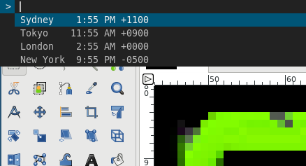

# tz-dmenu
tz-dmenu is a program that displays the current time in various time zones via [dmenu](https://tools.suckless.org/dmenu/).



Three versions of this program exist.
1. [Python](python/): this was the first version and Python was chosen due to my familiarity with the language.

2. [Rust](rust/): I decided to try and write this in Rust as a learning exercise. This version is missing nice error handling which would be good to add as I learn more.

3. [Racket](racket/): I've been playing with Racket in recent times and am always looking for an excuse to write more Racket code. This small program was a good opportunity to do this.

4. [Clojure](clojure/): Similar to Racket, Clojure has piqued my interest and this small program is not too ambitious to write in a new language.

## Components

### Python
- Python 3.6
- pytz : dealing with time zones

### Rust
- rust 1.41.0
- chrono : dealing with dates and times
- chrono-tz : dealing with time zones
- dirs : obtaining the user's configuraton directory
- toml : parsing toml
- subprocess : executing and communicating with child processes (similar to Python's subprocess)

### Racket
- Racket 7.6
- gregor : date and time library
- shell/pipeline : library for basic unix-style pipelines

### Clojure
- Clojure 1.10.1
- tick : date and time library
- me.raynes/conch : library for executing and communicating with child processes

## Usage

### Python
1. Create the config file `~/.config/tz_dmenu/config.ini` and populate it with the time zones you want to view. Here is an example:
```ini
[timezones]
Tokyo = Asia/Tokyo
```

2. Copy the program `python/tz_dmenu` to a location on your `PATH` and execute it or bind it to a keystroke combination.

### Rust
1. Create the config file `~/.config/tz_dmenu/config.toml` and populate it with the time zones you want to view. Here is an example:
```ini
[timezones]
Tokyo = Asia/Tokyo
```

2. Build a release version of the program.
```bash
$ cd rust
$ cargo build --release
```

3. Copy the program `rust/target/release/tz_dmenu` to a location on your `PATH` and execute it or bind it to a keystroke combination.

### Racket
1. Create the config file `~/.config/tz_dmenu/config.rkt` and populate it with the time zones you want to view. Here is an example:
```racket
(("Tokyo" . "Asia/Tokyo"))
```

2. Build a release version of the program.
```bash
$ cd racket
$ raco exe tz_dmenu.rkt
```

3. Copy the program `racket/tz_dmenu to a location on your `PATH` and execute it or bind it to a keystroke combination.

### Clojure
1. Create the config file `~/.config/tz_dmenu/config.edn` and populate it with the time zones you want to view. Here is an example:
```clojure
[{:name "Tokyo" :tz "Asia/Tokyo"}]
```

2. Run the program via `clj`.
```bash
$ clj -m tz-dmenu.core
```

I intended on creating a pre-built binary with GraalVM however I ran into issues with the date libraries that I tried using. Writing some Java interop might solve this problem however I will wait to see if either of these issues are fixed.
1. [`clojure.java-time`](https://github.com/dm3/clojure.java-time)
    > java_time.graph.Types cannot be cast to java.lang.Comparable

2. [`tick`](https://github.com/juxt/tick)
    > Exception in thread "main" java.lang.IllegalArgumentException: No matching method withZoneSameInstant found taking 1 args for class java.time.ZonedDateTime

## Credits
Inspired by [networkmanager-dmenu](https://github.com/firecat53/networkmanager-dmenu)
